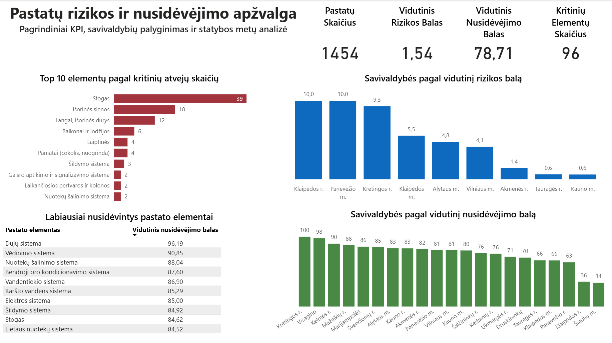
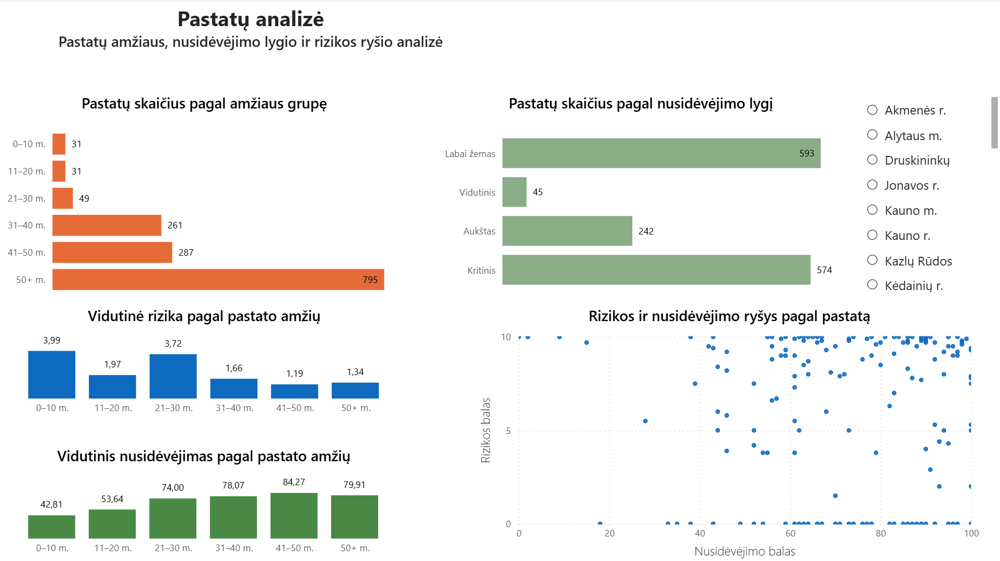
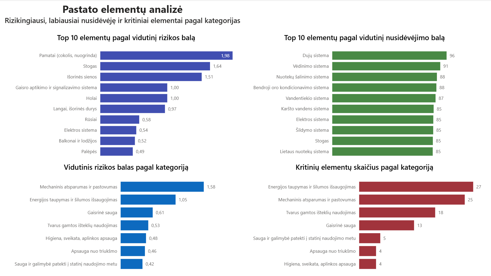

# Pastatų rizikos ir nusidėvėjimo analizė

## Projekto apžvalga
Šiame projekte sukūriau interaktyvų **Power BI dashboard**, skirtą **pastatų rizikos, nusidėvėjimo ir kritinių pastato elementų** analizei.

Ataskaita sukurta naudojant viešai prieinamus CSV duomenis ir susideda iš trijų pagrindinių analizės puslapių:

1. **Executive Overview**
2. **Pastatų analizė**
3. **Pastato elementų analizė**

Projekto tikslas – aiškiai ir struktūruotai parodyti:
- bendrą pastatų būklę
- savivaldybių skirtumus
- pastatų amžiaus ir nusidėvėjimo tendencijas
- rizikingiausius ir labiausiai nusidėvėjusius pastato elementus
- kategorijas, kuriose yra daugiausia kritinių elementų

---

## Projekto puslapiai

### 1. Executive Overview
Šiame puslapyje pateikiama bendra projekto apžvalga:
- pagrindinės KPI kortelės
- savivaldybių palyginimas pagal vidutinį rizikos balą
- savivaldybių palyginimas pagal vidutinį nusidėvėjimo balą
- Top 10 elementų pagal kritinių atvejų skaičių
- labiausiai nusidėvėję pastato elementai

### 2. Pastatų analizė
Šis puslapis skirtas pastatų lygmens analizei:
- pastatų skaičius pagal amžiaus grupę
- pastatų skaičius pagal nusidėvėjimo lygį
- vidutinė rizika pagal pastato amžių
- vidutinis nusidėvėjimas pagal pastato amžių
- sklaidos diagrama, rodanti rizikos ir nusidėvėjimo ryšį
- savivaldybių sliceris interaktyviam filtravimui

### 3. Pastato elementų analizė
Šis puslapis skirtas pastato elementų analizei:
- Top 10 elementų pagal vidutinį rizikos balą
- Top 10 elementų pagal vidutinį nusidėvėjimo balą
- vidutinis rizikos balas pagal kategoriją
- kritinių elementų skaičius pagal kategoriją

---

## Naudoti įrankiai
- **Power BI Desktop**
- **Power Query**
- **DAX**

---

## Duomenų paruošimas
Pradiniai CSV failai buvo importuoti į Power BI ir paruošti naudojant **Power Query**.

Duomenų paruošimas apėmė:
- kelių CSV failų importą
- duomenų tipų patikrinimą ir koregavimą
- laukų naudojimą vizualizacijose
- duomenų modelio paruošimą ataskaitoms ir analizei

---

## Duomenų modeliavimas ir skaičiavimai
Ataskaitoje naudoti:
- apskaičiuoti **DAX measure**
- KPI logika
- **Top N filtravimas**
- interaktyvūs sliceriai
- kategorijų ir elementų lygio palyginimai

Ataskaitoje pateikiami tokie analitiniai rodikliai kaip:
- vidutinis rizikos balas
- vidutinis nusidėvėjimo balas
- kritinių elementų skaičius
- Top 10 rizikingiausių elementų
- Top 10 labiausiai nusidėvėjusių elementų

---

## Vizualizacijos
Dashboarde naudojami keli vizualų tipai:
- KPI kortelės
- horizontalios juostinės diagramos
- stulpelinės diagramos
- sklaidos diagrama
- sliceris

Visame reporte buvo taikyta nuosekli spalvų logika:
- **mėlyna** – rizikos vizualams
- **žalia** – nusidėvėjimo vizualams
- **raudona** – kritinių elementų vizualams

---

## Duomenų šaltinis
Šiame projekte naudoti duomenys paimti iš **Lietuvos atvirų duomenų portalo** rinkinio:

**Pastatų ir jų elementų rizikos bei nusidėvėjimo duomenų rinkiniai**

Šaltinis:
`https://data.gov.lt/datasets/4143/?resource_version=3280`

Projekte naudoti CSV ištekliai, susiję su:
- pastatų rizika ir nusidėvėjimu
- pastato elemento rizika
- pastato elementų nusidėvėjimu

---

## Pagrindinės įžvalgos
Ši ataskaita leidžia nustatyti:
- savivaldybes, turinčias aukštesnį vidutinį rizikos balą
- savivaldybes, turinčias aukštesnį vidutinį nusidėvėjimo balą
- kritiškiausius pastato elementus
- labiausiai nusidėvėjusius pastato elementus
- elementų kategorijas, turinčias didžiausią vidutinę riziką
- kategorijas, kuriose fiksuojama daugiausia kritinių elementų
- ryšį tarp pastato amžiaus, rizikos ir nusidėvėjimo

---

## Ko išmokau
Šis projektas padėjo praktiškai sustiprinti šiuos įgūdžius:
- kelių puslapių Power BI ataskaitų kūrimą
- dashboard struktūros formavimą aiškiam istorijos pateikimui
- Power Query naudojimą duomenų importui ir paruošimui
- DAX measure kūrimą analizei
- Top N logikos ir slicerių naudojimą
- vizualinio nuoseklumo išlaikymą tarp kelių puslapių

---

## Repozitorijos struktūra
```text
.
├── AD-Pastatu_Rizikos_Analize.pbix
├── data/
│   ├── PastatoRizikaNusidevejimas.csv
│   ├── PastatoElementoRizika.csv
│   └── PastatoElementoNusidevejimas.csv
├── images/
│   ├── executive-overview.png
│   ├── pastatu-analize.png
│   └── pastato-elementu-analize.png
├── README.md
└── README-lt.md
```

---

## Ekrano nuotraukos

### Executive Overview


### Pastatų analizė


### Pastato elementų analizė


---

## Projekto santrauka
Šis projektas sukurtas kaip portfolio Power BI darbas, skirtas parodyti:
- dashboard kūrimą
- duomenų istorijos pateikimą per vizualizacijas
- duomenų paruošimą su Power Query
- analitinius skaičiavimus su DAX
- interaktyvių ataskaitų kūrimą Power BI aplinkoje

---

## Autorius
Sukūrė **Aras Dobrovolskis**